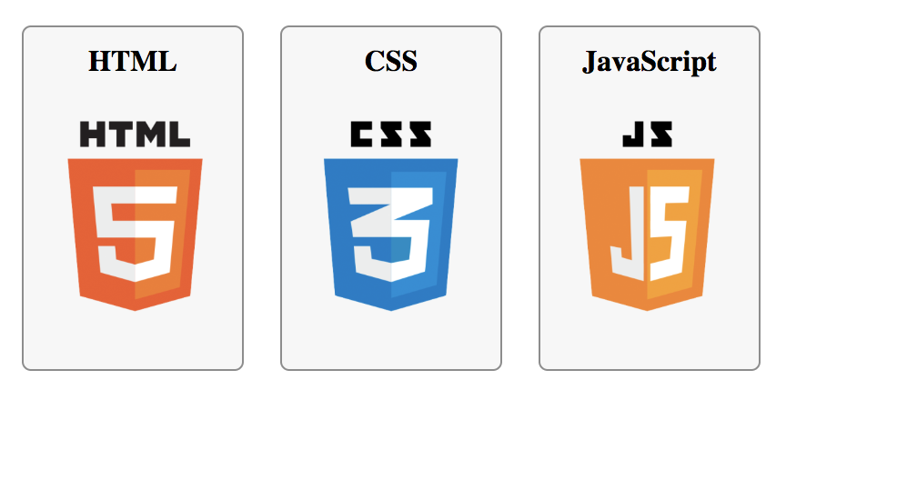
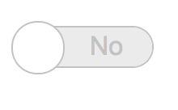

# Fun with CSS
## In this project, I will experiment and implement fun layout with HTML and CSS ONLY! Yes, no JavaScript!,

### [0. Sprite languages](./0-styles.css)
* Generate this layout:

### [1. Add new classes on sections](./1-styles.css)
* generate this layout where the underline is hidden by default and appeared slowly…:

### [2. Toggle](./2-styles.css)
* generate this layout where the <input> is has this custom toggle layout:

### [3. Menu](./3-index.html)
* generate this layout/animation:

## Author
* **Sergio Steben Arias Quintero** - [sarias12](https://github.com/sarias12)
